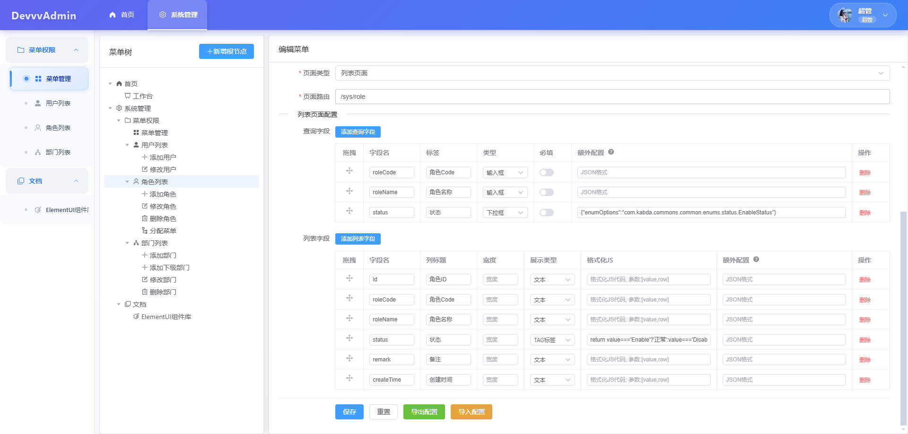
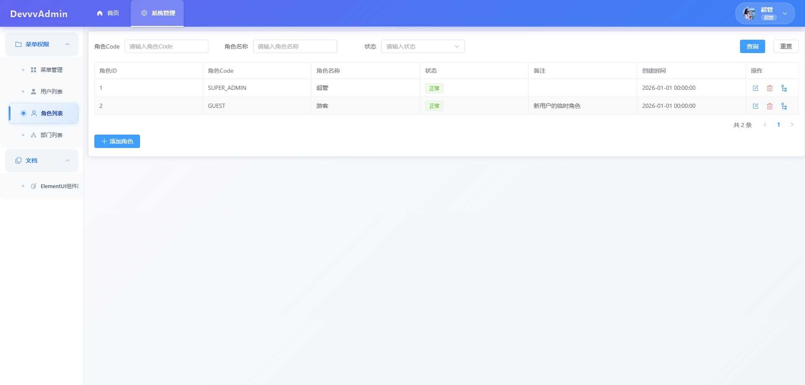

## DevvvAdmin（Vue 3）— 用配置驱动的后台管理系统

这是一个把「日常工作里 90% 以上后台系统需求」沉淀成**可配置**能力的前端项目：通过配置菜单/页面/按钮/弹窗/字段，即可快速拼装出可用的后台界面。项目与 AI 协作共建，适合在此基础上继续无缝二次开发。

- **在线演示**：[`https://demo.devvv.us.ci`](https://demo.devvv.us.ci/sys/menu)（使用 Mock 数据；请手下留情不要强刷）

### 核心功能

- **配置即功能**：列表页、查询条件、列字段、弹窗表单字段、弹窗列表字段、按钮行为，都可以通过配置生成
- **简单页面无需重打包**：只要后端提供接口，前端通过配置即可渲染出可用页面（内置渲染/交互逻辑）
- **复杂页面可自定义**：自行开发 Vue 组件，在菜单配置中填写组件名即可接入（该方式需要重新构建发布）
- **接口加密**：请求参数完全加密传输（RSA + AES），与后端保持同一加解密协议
- **增强图标系统**：Element Plus + Iconify 在线搜索（可扩展自定义图标）

---

### 技术栈

- Vue 3 + TypeScript + Vite
- Element Plus
- Pinia + Vue Router
- Axios

---

## 快速开始

### 安装 & 运行

```bash
npm install
npm run dev
```

### 构建

```bash
npm run build
```

---

## 环境变量（重要）

项目会读取以下环境变量（可在 `.env.development` / `.env.production` 配置）：

- **VITE_USE_MOCK**：是否启用 Mock（演示用）
- **VITE_USE_ENCRYPT**：是否启用加密（生产环境建议 `true`）
- **VITE_APP_VERSION**：客户端版本号（会进入客户端信息 `x-inf`）
- **VITE_RSA_PUBLIC_KEY**：RSA 公钥（后端提供，用于加密 AES key）

示例：

```env
VITE_USE_MOCK=false
VITE_USE_ENCRYPT=true
VITE_APP_VERSION=1.0.0
VITE_RSA_PUBLIC_KEY=xxx
```

---

## 核心理念：一套“菜单配置”，生成整个后台

项目把后台资源抽象成四类：**模块 / 目录 / 页面 / 按钮**。其中页面与按钮再细分行为类型，从而实现“配置驱动渲染”。

### 1) 菜单类型

- **模块（MODULE）**：顶部菜单（大分类）
- **目录（DIRECTORY）**：左侧菜单的聚合分类（可选层级）
- **页面（PAGE）**：左侧菜单，具备路由与页面类型
  - **列表页面（LIST）**：通用列表（查询/列字段/分页/树形等都可配置）
  - **自定义页面（CUSTOM）**：自己写 Vue 页面组件，通过配置接入
  - **外部页面（OUTER_LINK）**：菜单直接打开外链（可用于外部文档/系统入口）
- **按钮（BUTTON）**：挂载在页面内的操作入口（可出现在列表行、或列表底部）

### 2) 按钮位置

- **行级按钮（ROW）**：出现在表格每一行
- **底部按钮（FOOTER）**：出现在列表底部工具栏/按钮区

### 3) 按钮操作类型

- **弹窗表单（MODAL_FORM）**：配置表单字段，收集数据并提交到接口
- **弹窗列表（MODAL_LIST）**：弹出一个“迷你列表页”，可配置查询接口与列字段
- **确认框（CONFIRM）**：删除/危险操作二次确认，通过后才请求后端
- **导出（EXPORT）**：保持 POST 请求导出，并携带当前查询参数
- **文件下载（DOWNLOAD）**：类似 `<a>` 的 GET 下载
- **打开新页面（PAGE）**：类似 `<a target="_blank">` 打开新页/外链

> 具体枚举可参考：`src/types/menu.ts`

---

## 自定义页面开发（复杂页面接入）

当你需要复杂交互/图表/多 Tab 等自定义页面：

1. 在 `src/views/custom/` 下新增你的页面组件（例如 `UserAnalytics.vue`）
2. 在菜单管理中新增一个 **页面（PAGE）**，选择 **自定义页面（CUSTOM）**
3. 将 **自定义组件** 配置为你的组件名（要求与 `src/views/custom/` 下匹配）
4. 重新构建发布（因为自定义组件需要打包进产物）

---

## 接口请求与加密说明（RSA + AES）

项目在 `src/api/request.ts` 中实现了与后端一致的加密通信：

- **x-inf**：客户端信息（开发环境明文；生产环境 AES 加密）
- **x-arg**：RSA 加密后的 AES key（并带有前缀标识）
- **请求体**：JSON 请求在生产环境会被 AES 加密（`multipart/form-data` 上传不加密）
- **响应体**：在生产环境按需解密后再交给业务层

详细文档见：`docs/API_REQUEST.md`

---

## 代理与部署

- 开发环境：Vite 代理 `/cmsApi/*` 到后端（避免 CORS）
- 生产环境：建议用 Nginx 将 `/cmsApi/*` 转发到后端服务

详见：`docs/PROXY_CONFIG.md`

---

## 项目目录结构（重点文件）

```
web_vue/
├── docs/                      # 项目文档
├── src/
│   ├── api/                   # 接口封装（含加密与 Mock）
│   ├── api/mock/              # Mock 系统
│   ├── components/            # 通用渲染组件（列表/弹窗/动态表单等）
│   ├── layouts/               # 布局（左侧菜单 + 顶部模块）
│   ├── router/                # 路由
│   ├── stores/                # Pinia 状态
│   ├── types/                 # 核心类型（菜单/字段/按钮枚举）
│   ├── utils/                 # 工具（加密/客户端信息/路由工具等）
│   └── views/
│       ├── template/          # 通用模板页面（ListPage/CustomPage）
│       └── custom/            # 业务自定义页面入口（菜单配置引用这里的组件）
└── vite.config.ts             # Vite 配置（含代理）
```

---

## 项目截图




---

## 后端项目

后端项目代码正在整理中，敬请期待...

---

## 贡献 & 二次开发（与 AI 共建）

欢迎提交 Issue / PR：

- 配置模型增强（字段组件、校验规则、联动等）
- 通用页面模板增强（更多列表/表单能力）
- 内置示例与截图完善

